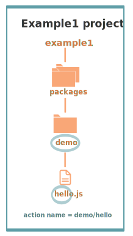

# Actions in the Nimbella Cloud

Actions are how you create stateless functions that run in the Nimbella Cloud. In general, an action is invoked in response to an event and produces some observable output. For example, an action can be used to detect the faces in an image, respond to a database change, respond to an API call, or post a Tweet.

In this article we'll show you the basics of working with actions in the Nimbella Cloud. We'll show you the basic project structure that the Nimbella deployer uses to deploy projects with no extra configuration. There are many variations on that project structure to accommodate multiple packages, no package, multiple actions within a directory, multiple action directories. As projects grow more complicated you can exert more finely tuned control by adding project configuration.

Project directory structure and configuration are described in detail the [Nimbella Command Line Tool Guide](https://nimbella.io/downloads/nim/nim.html#project-directory-structure). To create and deploy projects yourself, you'll need to install the `nim` desktop client, as described in that guide. With `nim` installed, you can deploy Nimbella projects to the Cloud from your local desktop or from GitHub.

## Action basics

An action can be created in any of the following ways:

* From a function, programmed using a number of [supported languages and runtimes](#languages-and-runtimes)
* From a binary-compatible executable
* From executables packaged as Docker containers.

The `nim` CLI operations to create, invoke, and manage actions are the same regardless of the actual function code.

### Source code functions and actions

To use a function as an action, it must conform to the following requirements:

- The function accepts a dictionary as input and produces a dictionary as output.

  The input and output dictionaries are key-value pairs, where the key is a string and the value is any valid JSON value. The dictionaries are canonically represented as JSON objects when interfacing to an action via the REST API or the `nim` CLI.

- The function must be called `main` or otherwise must be explicitly exported to identify it as the entry point.

  The mechanics may vary depending on your choice of language, but in general the entry point can be specified using the `--main` flag in `nim` commands.

Note the following additional considerations:

- Functions should be stateless, or *idempotent*. While the system does not enforce this property, there is no guarantee that any state maintained by an action will be available across invocations. In some cases, deliberately leaking state across invocations may be advantageous for performance, but also exposes some risks.
- Functions should follow best practices to reduce vulnerabilities by treating input as untrusted, and be aware of vulnerabilities they may inherit from third-party dependencies.

## Create a Nimbella project with an action

**[[NH I just noticed we have no examples of `nim action create` either here or in the CLI guide.]]**

Actions are contained within Nimbella projects that you create, and they are identified by fully qualified names that generally take the following form:

```
package-name/action-name
```

A Nimbella project with actions contains a _packages_ directory, with a subdirectory representing the name of the package.

For example, here's a project called `example1`, which contains a package named `demo` and an action named `hello`:



The fully qualified action name is `demo/hello`.

**Tip: **If you want an action to have a simple name (no package qualification), put it in a package directory called _default_. In that case, no package qualifier is prepended.

In this example, the action is a JavaScript function, indicated by the `.js` extension, and it runs using a [Node.js](http://nodejs.org/) runtime.

Here are the JavaScript contents of the file `hello.js`. It's a short function that accepts optional parameters and returns a standard greeting.

```js
/**
 * @params is a JSON object with optional fields "name" and "place".
 * @return a JSON object containing the message in a field called "msg".
 */
function main(params) {
  // log the parameters to stdout
  console.log('params:', params);

  // if a value for name is provided, use it else use a default
  var name = params.name || 'stranger';

  // if a value for place is provided, use it else use a default
  var place = params.place || 'somewhere';

  // construct the message using the values for name and place
  return {msg:  'Hello, ' + name + ' from ' + place + '!'};
}
```

## Invoke an action

Here's the `nim` command to invoke an action:

```
nim action:invoke ACTIONNAME
```

The colon is optional, so this form is also acceptable:

```
nim action invoke ACTIONNAME
```

For the `example1` project, the exact command is:

```
nim action invoke demo/hello
```

This command prints the following result to the terminal:

```json
{
  "msg": "Hello, stranger from somewhere!"
}
```

>**Tips for OpenWhisk developers:**
The `nim action invoke` command has somewhat different parameters than the `wsk action invoke` command:
* `nim action invoke` with no parameters is equivalent to `wsk action invoke --result` (or `-r`)
* `nim action invoke --full` (or `-f` for short) is equivalent to `wsk action invoke --blocking` (or `-b` for short)
* `nim action invoke --no-wait` (or `-n` for short) is equivalent to `wsk action invoke`
>

### Pass parameters to actions

Sometimes it's necessary or just convenient to provide values for function parameters. They can serve as defaults or as a way of reusing an action but with different parameters.

Actions receive parameters as input with the following flag:

 ```
   --param key value
```

where `key` is the property name and `value` is any valid JSON value.

The default output greeting in the `example1` project is "Hello, stranger from somewhere!" The `demo/hello` action accepts two optional input arguments, `name` and `place`, which can be used to tailor the response. Let's replace the words "stranger" and "somewhere" by specifying the following parameters:

* `name` with the value `"Dorothy"`
* `place` with the value `"somewhere"`

Here's how these parameters look in the `nim action invoke` command and its output:

```
nim action invoke /demo/hello --param name Dorothy --param place Kansas
{
  "msg": "Hello, Dorothy from Kansas!"
}
```

### Bind parameters to actions

You can bind parameters to an action and, unless overridden later by an invocation, they provide the specified value to the function.

Here's an example.

**Invoke the action to see the default values:**
```
nim action invoke demo/hello
{
  "msg": "Hello, stranger from somewhere!"
}
```

**Use `nim action update` to bind a new value for the `name` property to the action:**
```
nim action update demo/hello --param name Toto
ok: updated action demo/hello
```

**Invoke the action to test the new value:**
```
nim action invoke demo/hello
{
  "msg": "Hello, Toto from somewhere!"
}
```

You can provide additional parameters and the `name` parameter stays bound. Here's an example of using the --param flag for `place` when the `name` parameter has already been bound.

```
nim action invoke demo/hello --param place Kansas
{
  "msg": "Hello, Toto from Kansas!"
}
```

You can override the bound parameter in any `nim action invoke` command:

```
nim action invoke demo/hello --param place Kansas --param name Dorothy
{
  "msg": "Hello, Dorothy from Kansas!"
}
```

## Action execution

When an invocation request is received, the system records the request and dispatches an activation.

The system attempts to invoke the action once and records the `status` in the [activation record](#the-activation-record). Every invocation that is successfully received that the user might be billed for gets an activation record. See the section on [the activation record](#the-activation-record) for more details.

**Note:** If there's a network failure or other failure that intervenes before you receive an HTTP response, it's possible that `nim` received and processed the request. Check the activation record.

### System return from an invocation request

What the system returns from an invocation request depends on whether it's synchronous or asynchronous.

#### Synchronous requests

By default, the `nim action invoke` command is synchronous, meaning it waits for the activation result to be available. Synchronous requests are generally useful for rapid iteration and development, because you see the result. A synchronous request is also called a _blocking invocation request_, meaning the CLI _blocks_ until the activation completes.

The wait period for a blocking invocation request is the lesser of 60 seconds (the default for blocking invocations) or a configured timeout. If the time limit is exceeded, the activation continues processing in the system and an activation ID is returned so that you can check for the result later, the same as the result for asynchronous (nonblocking) requests.

If an action exceeds its configured time limit, [an error is recorded in the activation record](#the-activation-record).

#### Asynchronous requests

In contrast, when the activation request is asynchronous, the HTTP request terminates once the system has accepted the request to invoke an action. With an asynchronous request, the system returns an activation ID to confirm that the invocation was received. You can use this ID to retrieve the activation record.

To run a `nim` command asynchronously, use the `--no-wait` parameter, or `-n` for short, as in this command for the `example1` project to invoke the `demo/hello` action:

 ```
 nim action invoke demo/hello --no-wait
```

**Tip:** If you're an OpenWhisk developer, you'll notice that the `wsk action invoke` is asynchronous by default, wherease the `nim action invoke` command is synchronous by default.

### The activation record

Each invocation of an action results in an activation record, which contains the following fields:

- `activationId`: The activation ID.
- `namespace` and `name`: The namespace and name of the entity.
- `start` and `end`: Timestamps recording the start and end of the activation. The values are in [UNIX time format](http://pubs.opengroup.org/onlinepubs/9699919799/basedefs/V1_chap04.html#tag_04_15).
- `logs`: An array of strings with the logs that are produced by the action during its activation. Each array element corresponds to a line output to `stdout` or `stderr` by the action, and includes the time and stream of the log output. The structure is as follows: `TIMESTAMP` `STREAM:` `LOG LINE`.
- `annotations`: An array of key-value pairs that record [metadata](annotations.md#annotations-specific-to-activations) about the action activation.
- `response`: A dictionary that defines the following keys
  - `status`: The activation result, which might be one of the following values:
    - *"success"*: the action invocation completed successfully.
    - *"application error"*: the action was invoked, but returned an error value on purpose, for instance because a precondition on the arguments was not met.
    - *"action developer error"*: the action was invoked, but it completed abnormally, for instance the action did not detect an exception, or a syntax error existed. This status code is also returned under specific conditions such as:
      - the action failed to initialize for any reason
      - the action exceeded its time limit during the init or run phase
      - the action specified a wrong docker container name
      - the action did not properly implement the expected [runtime protocol](actions-new.md)
    - *"whisk internal error"*: the system was unable to invoke the action. **[[NH: is 'whisk' ok here? Note also in table below]]**
  - `statusCode`: A value between 0 and 3 that maps to the activation result, as described by the *status* field:

    | statusCode | status                 |
    |:---------- |:---------------------- |
    | 0          | success                |
    | 1          | application error      |
    | 2          | action developer error |
    | 3          | whisk internal error   |
  - `success`: Is *true* if and only if the status is *"success"*.
  - `result`: A dictionary as a JSON object which contains the activation result. If the activation was successful, this contains the value that is returned by the action. If the activation was unsuccessful, `result` contains the `error` key, generally with an explanation of the failure.

### View the activation record

Here are some common `nim activation` commands for viewing all or parts of the activation record.

<------ **[[NH: I found this line in the CLI guide but am not sure it applies here.]]
**Note:** The `nim activation` command is supported when used individually but not as part of a project.  ------------>

- `nim activation list`: lists all activations. See the next section for a list of flags for this command.
- `nim activation get --last`: retrieves the most recent activation record
- `nim activation result <activationId>`: retrieves only the result of the activation (or use `--last` to get the most recent result).
- `nim activation logs <activationId>`: retrieves only the logs of the activation.
- `nim activation logs <activationId> --strip`: strips metadata from each log line so the logs are easier to read.

#### `nim activation list` command flags

The `nim activation list` command lists all activations or activations filtered by namespace or name. The result set can be limited by using flags:

| Flag | Short option | Description |
| :--------- | :--- | :------- |
| `--full` | `-f` | include full activation description |
| `--limit LIMIT` | `-l` | only return LIMIT number of activations from the collection with a maximum LIMIT of 200 activations (default 30) |
| `--since SINCE` | | return activations with timestamps later than SINCE; measured in milliseconds since Th, 01, Jan 1970 |
| `--skip SKIP` | `-s` | exclude the first SKIP number of activations from the result |
| `--upto UPTO` | | Return activations with timestamps earlier than UPTO; measured in milliseconds since Th, 01, Jan 1970 |

#### `nim activation list` example output

List the last six activations:

```
nim activation list --limit 6
```

| Datetime | Activation ID | Kind | Start | Duration | Status | Entity |
| :--- | :--- | :--- | :--- | :--- | :--- | :--- |
| 2019-03-16 20:03:00 | 8690bc9904794c9390bc9904794c930e | nodejs:6  | warm  | 2ms | success | guest/tripleAndIncrement:0.0.1 |
| 2019-03-16 20:02:59 | 7e76452bec32401db6452bec32001d68 | nodejs:6  | cold | 32ms | success | guest/increment:0.0.1
| 2019-03-16 20:02:59 | 097250ad10a24e1eb250ad10a23e1e96 | nodejs:6 | warm | 2ms | success | guest/tripleAndIncrement:0.0.1 |
| 2019-03-16 20:02:58 | 4991a50ed9ed4dc091a50ed9edddc0bb | nodejs:6 | cold | 33ms | success | guest/triple:0.0.1 |
| 2019-03-16 20:02:57 | aee63124f3504aefa63124f3506aef8b | nodejs:6 | cold | 34ms | success | guest/tripleAndIncrement:0.0.1
| 2019-03-16 20:02:57 | 22da217c8e3a4b799a217c8e3a0b79c4 | sequence | warm | 3.46s | success | guest/tripleAndIncrement:0.0.1
</pre>

Here's the meaning of each column in the list:

| Column | Description |
| :--- | :--- |
| `Datetime` | The date and time when the invocation occurred. |
| `Activation ID` | An activation ID that can be used to retrive the result using the `nim activation get`, `nim activation result` and `nim activation logs` commands. |
| `Kind` | The runtime or action type |
| `Start` | An indication of the latency, i.e. if the runtime container was cold or warm started. |
| `Duration` | Time taken to execute the invocation. |
| `Status` | The outcome of the invocation. For an explanation of the various statuses, see the description of the `statusCode` below. |
| `Entity` | The fully qualified name of entity that was invoked. |

## Further considerations for creating actions

- An action executes in a sandboxed environment, namely a container. At any given time, a single activation will execute inside the container. Subsequent invocations of the same action may reuse a previous container, and there may exist more than one container at any given time, each having its own state.
- Invocations of an action are not ordered. If the user invokes an action twice from the command line or the REST API, the second invocation might run before the first. If the actions have side effects, they might be observed in any order.
- There is no guarantee that actions will execute atomically. Two actions can run concurrently and their side effects can be interleaved. `nim` does not ensure any particular concurrent consistency model for side effects. Any concurrency side effects will be implementation-dependent.
- Actions have two phases: an initialization phase, and a run phase. During initialization, the function is loaded and prepared for execution. The run phase receives the action parameters provided at invocation time. Initialization is skipped if an action is dispatched to a previously initialized container. This is referred to as a _warm start_. You can tell if an [invocation was a warm activation or a cold one requiring initialization](annotations.md#annotations-specific-to-activations) by inspecting the activation record.
- An action runs for a bounded amount of time. This limit can be configured per action, and applies to both the initialization and the execution separately. If the action time limit is exceeded during the initialization or run phase, the activation's response status is _action developer error_.

## Other action commands

### Get metadata for actions

Metadata that describes existing actions can be retrieved via the `nim action get` command.

**[[NH: check output, looks like the original had no package so my command is wrong?]]**
```
nim action get demo/hello
ok: got action demo/hello
{
    "namespace": "guest",
    "name": "hello",
    "version": "0.0.1",
    "exec": {
        "kind": "nodejs:6",
        "binary": false
    },
    "annotations": [
        {
            "key": "exec",
            "value": "nodejs:6"
        }
    ],
    "limits": {
        "timeout": 60000,
        "memory": 256,
        "logs": 10
    },
    "publish": false
}
```

### Get the URL for an action

An action can be invoked through the REST interface via an HTTPS request.

To get an action URL, execute the following command:

```
nim action get demo/hello --url
```

A URL with the following format will be returned for standard actions:
```
ok: got action actionName
https://${APIHOST}/api/v1/namespaces/${NAMESPACE}/actions/demo/hello
```

**[[NH: check link]]**
Authentication is required when invoking an action via an HTTPS request using this resource path. For more information regarding action invocations using the REST interface, see [Using REST APIs with OpenWhisk](rest_api.md#actions).

**[[NH: check link:]]**
Another way of invoking an action that does not require authentication is via [web actions](webactions.md#web-actions).

Any action may be exposed as a web action, using the `--web true` command line option when creating or updating an action.

```
nim action update demo/hello --web true
ok: updated action demo/hello
```

The resource URL for a web action is different:
```
nim action get demo/hello --url
ok: got action demo/hello
https://${APIHOST}/api/v1/web/${NAMESPACE}/${PACKAGE}/demo/hello
```

You can use `curl` or `wget` to invoke the action.
```
curl `nim action get demo/hello --url | tail -1`.json
{
  "payload": "Hello, Toto from somewhere!"
}
```

### Save action code

Code associated with an existing action may be retrieved and saved locally. Saving can be performed on all actions except sequences and docker actions.

1. Save action code to a filename that corresponds with an existing action name in the current working directory. A file extension that corresponds to the action kind is used. An extension of _.zip_ is used for action code that is a zip file.

  **[[NH: please check command and output:]]**
  ```
  nim action get /example1/packages/demo/hello --save
  ok: saved action code to /path/to/packages/demo/hello/hello.js
  ```

2. You can provide your own file name and extension by using the `--save-as` flag.

  **[[NH: check output:]]**
  ```
  nim action get /example1/packages/demo/hello --save-as hellogreeting.js
  ok: saved action code to /path/to/packages/demo/hello/hellogreeting.js
  ```

### List actions

You can list all the actions that you have created using the following commnand:

```
nim action list
  actions
  /guest/mySequence                  private sequence
  /guest/greeting                    private nodejs:6
```

Here, we see actions listed in order from most to least recently updated. For easier browsing, you can use the flag `--name-sort` or `-n` to sort the list alphabetically:

**[[NH: Output list seems backwards for alphabetical order?]]**
```
nim action list --name-sort
  actions
  /guest/mySequence                  private sequence
  /guest/greeting                    private nodejs:6
```

The list is now sorted alphabetically by namespace, then package name if any, and finally action name, with the default package (no specified package) listed at the top. **[[NH: Is namespace listed in this output example? What does output look like if there's a package? Does nim output list the namespace?]]**

**Note**: The printed list is sorted alphabetically after it is received from the platform. Other list flags such as `--limit` and `--skip` are applied to the block of actions before they are received for sorting. To list actions in order by creation time, use the flag `--time`.

To filter your list of actions to just those within a specific package, use this command:

**[[NH: please check command and output:]]**
```
nim action list /demo
```
```
actions
/demo/hello                private nodejs:6
/demo/hello-followup       private nodejs:6
```

## Delete actions

You can clean up by deleting actions that you do not want to use.

1. Run the following command to delete an action:
  ```
  nim action delete demo/hello-followup
  ok: deleted demo/hello-followup
  ```

2. Verify that the action no longer appears in the list of actions.
  ```
  nim action list
  ```
  ```
  actions
  /demo/hello                private sequence

  ```

**[[NH: Occurs to me it might be helpful to say whether these `nim action` commands work just locally or both locally and deployed.]]**


## Access action metadata within the action body

**[[NH: "OpenWhisk assets" in next paragraph ok?]]**

The action environment contains several properties that are specific to the running action. These allow the action to programmatically work with OpenWhisk assets via the REST API or set an internal alarm when the action is about to use up its allotted time budget.

**[[NH: Not sure what to do with these properties--please advise. Also note link to annotations.md]]**

The properties are accessible via the system environment for all supported runtimes: Node.js, Python, Swift, Java and Docker actions.

* `__OW_API_HOST` the API host for the OpenWhisk deployment running this action.
* `__OW_API_KEY` the API key for the subject invoking the action, this key may be a restricted API key. This property is absent unless explicitly [requested](./annotations.md#annotations-for-all-actions).
* `__OW_NAMESPACE` the namespace for the _activation_. This may not be the same as the namespace for the action.
* `__OW_ACTION_NAME` the fully qualified name of the running action.
* `__OW_ACTION_VERSION` the internal version number of the running action.
* `__OW_ACTIVATION_ID` the activation ID for this running action instance.
* `__OW_DEADLINE` the approximate time for this action to consume its entire duration quota (measured in epoch milliseconds).

###Watch action output

`nim` actions might be invoked by other users in response to various events. In such cases it can be useful to monitor the invocations.

You can use the `nim` CLI to watch the output of actions as they are invoked.

1. Issue the following command from a shell:
```
nim activation poll
```

This command starts a polling loop that continuously checks for logs from activations.

2. Switch to another window and invoke an action:

**[[NH: check command output:]]**
```
nim action invoke /demo/hello
ok: invoked /whisk.system/samples/helloWorld with id 7331f9b9e2044d85afd219b12c0f1491
```

3. Observe the activation log in the polling window:
**[[NH: check output:]]**
```
Activation: helloWorld (7331f9b9e2044d85afd219b12c0f1491)
  2016-02-11T16:46:56.842065025Z stdout: hello bob!
```

Similarly, whenever you run the poll utility, you see in real time the logs for any actions running on your behalf.

## Languages and Runtimes
Here are languages and runtimes supported in the Nimbella Cloud.

### Supported languages for actions

* [Ballerina](actions-ballerina.md)
* [Go](actions-go.md)
* [Java](actions-java.md)
* [JavaScript](actions-nodejs.md)
* [PHP](actions-php.md)
* [Python](actions-python.md)
* [Ruby](actions-ruby.md)
* [Rust](actions-rust.md)
* [Swift](actions-swift.md)
* [.NET Core](actions-dotnet.md)
* [Docker and native binaries](actions-docker.md)

<---- **[[NH: Delete this paragraph? I deleted the 'action sequences' section.]]**
Multiple actions from different languages may be composed together to create a longer processing pipeline called a [sequence](#creating-action-sequences). The polyglot nature of the composition is powerful in that it affords you the ability to use the right language for the problem you're solving, and separates the orchestration of the dataflow between functions from the choice of language. A more advanced form of composition is described [here](conductors.md).---->

### Supported runtimes

The Nimbella deployer determines the kind of runtime required for the action from the file suffix. The following runtimes are supported:

* Node.js for suffix .js
* Python for suffix .py
* Java for suffixes .java and .jar
* Swift suffix .swift
* PHP for suffix .php
* Go for suffix .go
